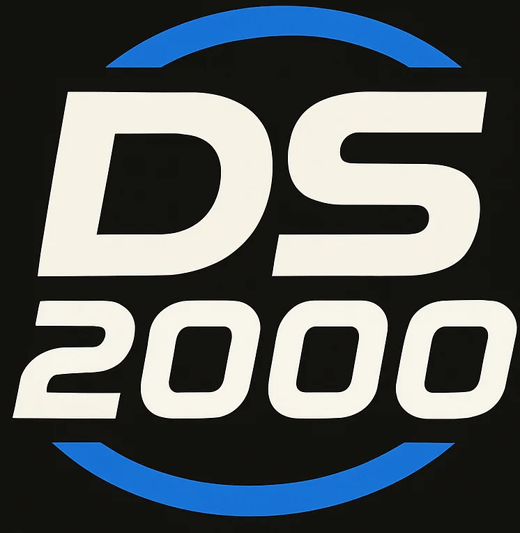

<p align="center">
  
</p>

# DS2000

A professional, open-source desktop application for Discord integration and hardware device control. Built with Rust, Tauri and html&css.

## Features

- **Discord Integration**: Monitor Discord status, control voice settings (mute/deafen) from a dedicated interface
- **Hardware Control**: Serial communication with custom devices for RGB LED control and button input
- **System Tray Integration**: Minimize to system tray with quick access
- **Cross-Platform**: Windows, macOS, and Linux support planned

## Screenshots

*Coming soon - Add screenshots of the application UI*

## Table of Contents

- [Requirements](#requirements)
- [Installation](#installation)
- [Quick Start](#quick-start)
- [Configuration](#configuration)
- [Usage](#usage)
- [Development](#development)
- [Project Structure](#project-structure)
- [Related Projects](#related-projects)
- [Contributing](#contributing)
- [License](#license)
- [Support](#support)

## Requirements

### System Requirements

- **Windows**: Windows 10 or later (primary platform)
- **macOS**: macOS 10.13 or later (planned)
- **Linux**: Ubuntu 18.04 or later (planned)

### Development Requirements

- **Rust**: 1.70 or later ([Install Rust](https://rustup.rs/))
- **Node.js**: 18.0 or later ([Install Node.js](https://nodejs.org/))
- **npm**: 9.0 or later (comes with Node.js)

### Runtime Requirements

- **Serial Port Access**: For hardware communication (USB drivers may be required)
- **Discord Developer Account**: For Discord integration features and access key generation

## Installation

### From Releases (Recommended for Users)

1. Download the latest release from the [Releases](https://github.com/Mechanix97/DS2000/releases) page
2. Download the `.msi` installer (Windows) or appropriate package for your OS
3. Run the installer and follow the on-screen instructions
4. Launch DS2000 from your Start Menu or Applications

### From Source (For Developers)

See [Development Setup](#development-setup) section below.

## Quick Start

### 1. Initial Setup

On first launch, you'll need to configure:

- **Discord OAuth**: Click on Settings > Discord Configuration to authenticate
- **Serial Device**: The application will auto-detect connected devices

### 2. Discord Integration

1. DS2000 will automatically connect to discord if the developer credentials are setted.
2. Authenticate with your Discord account in the browser window
3. Once connected, your status will appear in the interface

### 3. Hardware Control

1. Connect your DS2000 device via USB
2. Go to **RGB** tab
3. Select lighting mode: Cycling, Breathing, or Fixed
4. Adjust brightness and colors
5. Changes are applied in real-time

### 4. Voice Control

- Click the **microphone icon** to mute/unmute
- Click the **headset icon** to deafen/undeafen
- Status updates are sent to Discord in real-time

## Configuration

### Discord OAuth Setup

1. Create a Discord Application at https://discord.com/developers/applications
2. Get your Client ID and Client Secret
3. Set Redirect URI to: `http://localhost:3000/callback` (requiered by discord but not used)
4. Configuration is stored in `~/.ds2000/config.json`

### Serial Device Configuration

The application automatically scans for connected serial devices at:
- **Baudrate**: 115200
- **Timeout**: 1000ms

Modify these constants in `src-tauri/src/controller/controller.rs` if needed.

### Application Settings

Settings are stored in the user's home directory:
- **Windows**: `C:\Users\{Username}\.ds2000\`
- **macOS**: `/Users/{Username}/.ds2000/`
- **Linux**: `/home/{Username}/.ds2000/`

Configuration files:
- `config.json` - Main application settings
- `discord_tokens.enc` - Encrypted Discord OAuth tokens
- `app_state.json` - UI state (window size, etc)

## Usage

### System Tray

The application runs in the system tray by default:
- **Single Click**: Show/hide window
- **Right Click Menu**:
  - "Open DS2000": Show application window
  - "Quit": Exit application

### RGB Controls

**Modes:**
- **Cycling**: Colors cycle through the spectrum
- **Breathing**: Pulsing breathing effect
- **Fixed**: Static color selection

**Controls:**
- Brightness slider: 0-255
- LED 1 Color sliders: Red, Green, Blue (0-255 each)
- LED 2 Color sliders: Red, Green, Blue (0-255 each)

Changes are sent to the device immediately via serial protocol.

### Voice Settings

**Indicators:**
- Microphone icon: Shows mute status (red = muted)
- Headset icon: Shows deafen status (red = deafened)

Click to toggle. Discord status updates automatically.

### Settings & About

- **Settings Tab**:
  - Discord connection status
  - Serial device connection status
  - Startup options (planned)

- **About Tab**:
  - Application version
  - Developer information
  - Links to terms of service and privacy policy

## Development

### Development Setup

1. **Clone the repository**
   ```bash
   git clone https://github.com/Mechanix97/DS2000.git
   cd DS2000
   ```

2. **Install dependencies**
   ```bash
   # Install Rust (if not already installed)
   curl --proto '=https' --tlsv1.2 -sSf https://sh.rustup.rs | sh

   # Install frontend dependencies
   cd src-tauri/frontend
   npm install
   cd ../..
   ```

3. **Run in development mode**
   ```bash
   make run
   ```

This will:
- Start the Vite development server (frontend hot reload)
- Compile and run the Rust backend
- Open the application window

### Available Commands

```bash
# Build frontend (production)
cd src-tauri/frontend
npm run build

# Build Rust backend
cargo build

# Format all code (required before commits)
cargo fmt

# Run linting checks (must pass before PRs)
cargo clippy --all-targets --all-features

# Run tests
cargo test

# Build production application
npm run tauri build    # Creates installer

# Run with debug logging
RUST_LOG=debug npm run tauri dev
```

### Project Structure

```
DS2000/
├── README.md                        # This file
├── CLAUDE.md                        # Development guidelines (for Claude Code)
├── Cargo.toml                       # Rust workspace configuration
├── package.json                     # Root npm configuration
├── src-tauri/
│   ├── Cargo.toml                   # Backend dependencies
│   ├── tauri.conf.json              # Tauri configuration
│   ├── src/
│   │   ├── main.rs                  # Application entry point
│   │   ├── backend/                 # Backend modules
│   │   │   ├── discord/             # Discord integration
│   │   │   └── serial/              # Serial device communication
│   │   ├── controller/              # Application controller
│   │   ├── config/                  # Configuration management
│   │   └── common/                  # Shared types
│   └── frontend/
│       ├── index.html               # HTML template
│       ├── package.json             # Frontend dependencies
│       ├── backendEvents.js         # Event handling
│       ├── styles.css               # Application styles
│       └── vite.config.js           # Vite configuration
└── docs/                            # Additional documentation (planned)
```

### Code Quality Standards

This is a open-source project. All contributions must meet these standards:

- **Rust Code**:
  - Must pass `cargo fmt` (formatting)
  - Must pass `cargo clippy` with no warnings (linting)
  - Must have no `unwrap()` without justification
  - Proper error handling with context

- **Frontend Code**:
  - Valid HTML5
  - No console errors or warnings

- **Git Workflow**:
  - Create feature branches: `git checkout -b feature/description`
  - All changes via Pull Requests
  - PRs require code review and must pass all checks

- **Commit Messages**:
  - Clear, descriptive format
  - Follow conventional commits: `feat:`, `fix:`, `docs:`, `refactor:`, etc.
  - Example: `feat: add RGB color picker`

### Debugging

**Enable debug logging:**
```bash
RUST_LOG=debug make run
```

**Specific modules:**
```bash
RUST_LOG=serial=debug,discord=info make run
```

**Frontend debugging:**
- Open Developer Tools: `Ctrl+Shift+I` (Windows) or `Cmd+Option+I` (macOS)
- View Console for JavaScript errors
- Inspect Elements for CSS issues

### Testing

Run the test suite:
```bash
make test

# With output
cargo test -- --nocapture

# Specific test
cargo test serial_message::tests
```

## Related Projects

DS2000 is part of an integrated hardware and software ecosystem:

- **[DS2000 Firmware](https://github.com/Mechanix97/DS2000-Firmware)**: Embedded firmware for the hardware device
- **[DS2000 PCB](https://github.com/Mechanix97/DS2000-PCB)**: KiCAD schematics and PCB design files

All projects are licensed under **GPL v3** to ensure the entire ecosystem remains open-source.

## Contributing

We welcome contributions! Please read our [Contributing Guidelines](CONTRIBUTING.md) before submitting pull requests.

**Before submitting a PR:**

1. Fork the repository
2. Create a feature branch: `git checkout -b feature/your-feature`
3. Make your changes
4. Format code: `cargo fmt`
5. Run linting: `cargo clippy`
6. Test your changes: `cargo test`
7. Commit with clear message: `git commit -m "feat: your feature description"`
8. Push to your fork: `git push origin feature/your-feature`
9. Open a Pull Request with detailed description

**PR Requirements:**
- Clear description of changes
- Reference related issues if applicable
- Passes all CI checks
- At least one code review approval

## License

This project is licensed under the **GNU General Public License v3.0** - see the [LICENSE](LICENSE) file for details.

### Key Points:

- ✅ **Free to use**: Anyone can use and modify the code
- ✅ **Open source**: All derivatives must remain open source
- ✅ **No commercial closed versions**: You cannot create proprietary versions
- ✅ **Donations accepted**: You can accept voluntary donations for your work
- ✅ **Attribution required**: Derivatives must credit original work

This ensures DS2000 remains free and open for the entire community.

## Support

### Getting Help

- **Documentation**: See [CLAUDE.md](CLAUDE.md) for development documentation
- **Issues**: Check [GitHub Issues](https://github.com/Mechanix97/DS2000/issues) for known problems
- **Discussions**: Join our [GitHub Discussions](https://github.com/Mechanix97/DS2000/discussions)
- **Discord**: Join our community on [Discord](https://discord.gg/VtbFAGJe86)

### Reporting Issues

Found a bug? Please create an issue with:
- Clear title describing the problem
- Steps to reproduce
- Expected vs actual behavior
- Your system information (OS, versions)
- Relevant logs (use `RUST_LOG=debug`)

### Feature Requests

Have an idea? Open a GitHub issue with the `enhancement` label and describe:
- The feature you'd like to see
- Why it would be useful
- Any implementation ideas

### Support the Project

If you find DS2000 useful, consider supporting the development:

- 💰 **Donate**: *Donation links coming soon*
- ⭐ **Star the repository** to show your support
- 🐛 **Report bugs** to help us improve
- 🚀 **Contribute code** to add new features
- 📢 **Share** with others who might find it useful

## Roadmap

### Phase 1 (Current)
- ✅ Core Discord integration
- ✅ Serial device communication
- ✅ RGB LED control
- ✅ Voice settings management

### Phase 2 (Planned)
- [ ] Linux support
- [ ] macOS support
- [ ] Custom device profiles
- [ ] Macro recording
- [ ] Settings persistence improvements
- [ ] Update checker

### Phase 3 (Future)
- [ ] Plugin system for third-party integrations
- [ ] Mobile companion app
- [ ] Cloud synchronization
- [ ] Performance optimizations

## Acknowledgments

**Author**: [Mechardo Labs](https://www.mechardo3d.xyz/)

**Contributors**: Thanks to all who contribute to this project!

## Disclaimer

DS2000 is provided as-is for personal use. Users are responsible for:
- Complying with Discord's Terms of Service
- Proper handling of authentication credentials
- Safe use of hardware controls

This application is not affiliated with or endorsed by Discord Inc.

---

**Last Updated**: August 21, 2025
**Current Version**: 0.1.1
**Status**: Active Development
**License**: GPL v3.0
